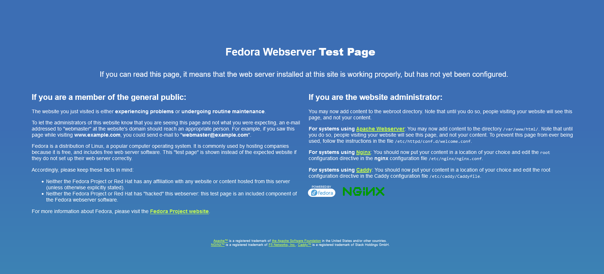
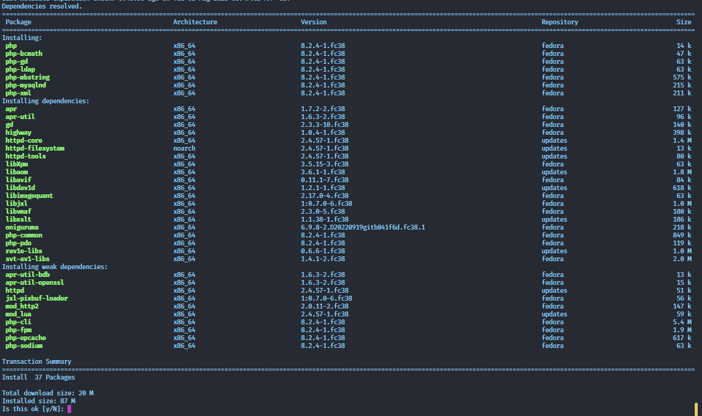

How to install zabbix on fedora 
------------------------------------------------
Pues este sitio sera util para poder describir el proceso de instalacion de zabbix sobre fedora.

## INTRODUCCION
Tratare de seguir varias guias hasta llegar a la guia definitiva para fedora, al parecer no existe la definitiva

## Install web server
En nuestro caso estamos escogiendo nginx el preferido para mis despliegues

```shell
sudo dnf -y install nginx
```

Enter y at the prompt to confirm that you want to install the package.

After the installation completes, run the following commands to enable and start
the service. These commands start Nginx and configure it to start up when the
server does.

```shell
sudo systemctl enable nginx
sudo systemctl start nginx
```
### Open the firewall for nginx

```shell
sudo firewall-cmd --permanent --add-service=http
sudo firewall-cmd --permanent --add-service=https
```
Reload to apply new settings
```shell
sudo firewall-cmd --reload
```

Si todo salio bien, veremos la siguiente ventana en el navegador


## Install php libraries
Como era de esperarse zabbix esta construido con php, por tanto hay que instalar las librerias necesarias para su ejecucion

```shell
sudo dnf install php-8.2.4-1.fc38.x86_64 php-mysqlnd-8.2.4-1.fc38.x86_64 php-ldap-8.2.4-1.fc38.x86_64 php-bcmath-8.2.4-1.fc38.x86_64 php-mbstring-8.2.4-1.fc38.x86_64 php-gd-8.2.4-1.fc38.x86_64 php-gd-8.2.4-1.fc38.x86_64 php-xml-8.2.4-1.fc38.x86_64
```



### Modificar el archivo php.ini
El archivo php.ini, contiene directivas para el uso de php al desplegarse la aplicacion en php, en esta caso zabbix
Para modificar el archivo `php.ini` se debe ingresar a este con un editor en este caso nvim

```bash
sudo nvim /etc/php.ini
```

Encontramos las siguientes lineas que debemos cambiar:

```text
post_max_size = 16M
upload_max_filesize = 2M
max_execution_time 300
max_input_time = 300
memory_limit 128M
session.auto_start = 0
mbstring.func_overload = 0
date.timezone = Europe/Bucharest
```


## BIBLIOGRAFIA

[tutorial para centOS](https://www.tecmint.com/install-and-configure-zabbix-monitoring-on-debian-centos-rhel/)

[documentation official zabbix database](https://www.zabbix.com/documentation/6.4/en/manual/appendix/install/db_scripts)

[zabbix packages](https://www.zabbix.com/download?zabbix=6.4&os_distribution=red_hat_enterprise_linux&os_version=9&components=server_frontend_agent&db=mysql&ws=apache)

